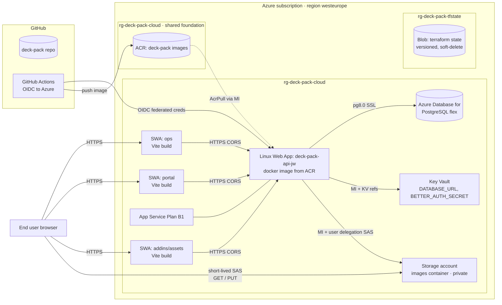
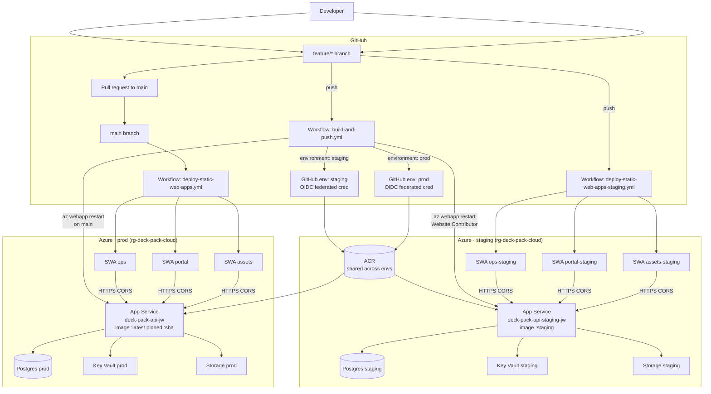
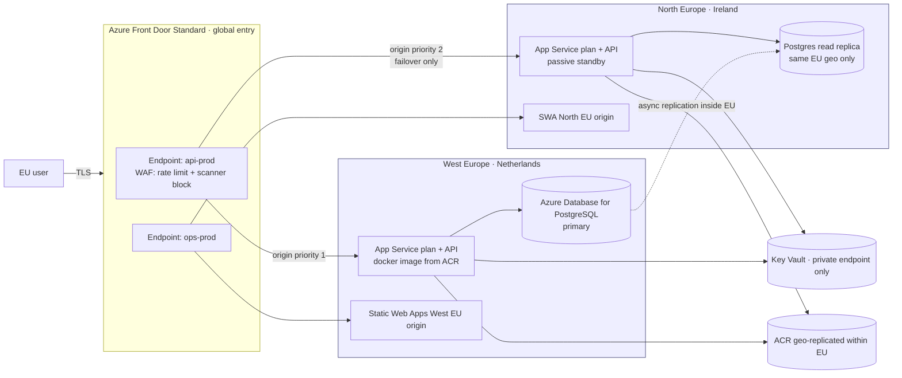

# DeckPack — Cloud Computing Hand-in

Companion to [`module.md`](./module.md). Diagrams are Mermaid so they render directly
on GitHub / in VS Code preview.

---

## 1. Architecture — production only

**Key ideas captured:**

- Three Vite frontends on **Azure Static Web Apps**, a single Hono/tRPC API on **App Service (Linux container)**, with **ACR** as the registry, **Azure Database for PostgreSQL** for data, **Key Vault** for secrets, **Azure Storage** for user/admin image uploads using **managed-identity-signed SAS**.
- **No long-lived storage or DB credentials** on the Web App — only Key Vault references and Entra ID role assignments.
- **Terraform state** lives in its own RG (`rg-deck-pack-tfstate`) so it survives destruction of application resources.

---

## 2. Architecture — prod + staging + CI/CD flow

**Flow captured:**

- **Feature branch push** → API workflow builds image tagged `:<sha>` + `:staging`, pushes to ACR, restarts the staging Web App. Staging SWA workflow deploys the frontends to the `*-staging` SWA resources.
- **PR open/update** → GitHub branch protection runs the required checks on the PR (CI as merge gate).
- **Merge to `main`** → same pipeline runs with `environment: prod`; image is tagged `:<sha>` + `:latest`; prod Web App is restarted; prod SWA workflow ships the frontends.
- **Rollback** = set `api_image_tag` in `terraform/envs/prod/app-service/terraform.tfvars` to a previous 7-char SHA and re-apply, or redeploy a previous commit via GitHub Actions for SWA.

---

## 3. Future — Azure Front Door for multi-region with strict EU data residency

**Data residency notes:**

- Both regions are **inside the EU data boundary** (West EU + North EU). Cross-region replication stays within that boundary.
- **Azure Front Door** is a global service but only **routes** traffic — user data transits through AFD’s EU POPs when the user is in the EU; **persistent data never leaves EU**.
- **WAF policy** lives on the AFD profile (rate limiting, scanner-path blocking).
- Postgres **geo-redundant backup** must be **disabled or EU-pinned** to avoid accidental cross-region replication.
- App Service origins are locked so only AFD can reach them (via `x_azure_fdid` header check on the App Service access restrictions) — see `terraform/README.md`.

---

## 4. Cost analysis + reduction strategies

Prices are **West Europe, PAYG, rough monthly € figures** (Azure pricing changes; confirm in Pricing Calculator before any claim to an examiner).

| Component                                                             | Today             | Monthly order of magnitude                   | Notes                                            |
| --------------------------------------------------------------------- | ----------------- | -------------------------------------------- | ------------------------------------------------ |
| **App Service plan B1** × 2 (prod + staging)                          | 1 plan per env    | ~€12–14 each                                 | `always_on = true`, Linux, single small instance |
| **Azure DB for PostgreSQL flex** (smallest burstable, prod + staging) | 2 servers         | ~€15–30 each                                 | Storage + backup extra                           |
| **Static Web Apps** (Free tier × 6 sites)                             | 6 SWAs            | €0                                           | Free tier is generous for low-traffic projects   |
| **ACR Basic**                                                         | 1 shared registry | ~€4                                          | One per subscription is fine                     |
| **Storage (Blob) LRS**, low volume                                    | 2 accounts        | < €1 each                                    | Egress dominates once used                       |
| **Key Vault Standard**                                                | 2 vaults          | ~€0.02 per 10k ops                           | Effectively free at your scale                   |
| **GitHub Actions** (public or free minutes)                           | Varies            | €0 on public repo or within included minutes |                                                  |
| **Azure Front Door Standard** (future)                                | 0 today           | ~€30 base + traffic                          | Blocked on student subscription                  |

**Total today (student PAYG): roughly €50–120/month**, dominated by App Service plans + Postgres.

### Reduction strategies, ranked

2. **Consolidate staging onto one App Service plan** if you ever need more apps — plan is priced, sites on it are free.
3. **Schedule staging off-hours** via an Azure Automation runbook or a GitHub Action that calls `az webapp stop` at night and `az webapp start` in the morning.
4. **Use `:sha` tag for prod** and keep **one active App Service slot** rather than standing up a deployment slot per env; slots double plan RAM.
5. **Postgres Burstable B1ms** for staging, plus **geo-redundant backups off** where not needed. For “real” prod, only move up when load justifies it.
6. **Free tier SWA everywhere** — you’re already there; avoid accidental Standard-tier creation.
7. **ACR retention policy** — prune untagged manifests older than N days (saves storage once image history grows).
8. **CI cache** — you already set up `cache-to: type=gha,mode=max`. This reduces build minutes, which matters only if you leave the free minutes band.
9. **Front Door: defer** until you actually need global edge/WAF. It’s the single biggest recurring cost once added.
10. **Egress** — storage + API response egress is the first thing that balloons if traffic grows; CDN / AFD in front of blob for public assets (not user-specific images) reduces egress by caching.

### What _costs_ vs what _gives value_

- The **App Service plan + Postgres** are ~80% of your bill but are the **reliability backbone**: managed patching, backups, TLS, logs. That’s the “cost vs value” story — you’re paying for _operations you don’t run_.
- **Key Vault + managed identity** cost near-zero but remove an entire class of secret-leak incidents — high-value, low-cost.

---

## 5. Topics — text you can put into the report

Each block is short on purpose: examiners don’t want a novel. Titles match the module brief order.

### Cloud architecture fit

DeckPack uses a **cloud-native PaaS** shape: stateless containerized API, managed Postgres, static frontends on a managed CDN-backed service, secrets in Key Vault, identity via Entra ID. The API is a **12-factor** app — config from env vars, stateless instances, logs to stdout. Horizontal scale is a plan-tier change, not a code change.

### Declarative infrastructure and IaC

Everything under `terraform/` is **Terraform with remote state in Azure Blob** (`terraform/README.md` documents the bootstrap). Modules are **reusable HCL** (`terraform/modules/`); environments are **thin roots** (`terraform/envs/<env>/<stack>/`) that instantiate a module and pass env-specific inputs. **Cross-stack data flows via `terraform_remote_state`**, not copy-pasted tfvars — e.g. `prod/app-service` reads SWA URLs from `prod/static-web-apps` state to build its CORS list.

### Reproducibility (containerization)

`docker/api.Dockerfile` uses **multi-stage build** (Node 22 slim + pnpm) and ships a `node dist/index.mjs` under `tini`. Local Postgres is `packages/db/docker-compose.yml`. The same image that CI pushes to ACR is what App Service runs in prod and staging — **byte-for-byte identical**, only env vars differ.

### Delivery pipeline quality and reliability practices

- **OIDC** from GitHub Actions to Entra ID — no long-lived client secrets on the CI side.
- **Env-scoped federated creds** (`staging`, `prod`) — the subject on the OIDC token determines which Azure identity / scopes apply.
- **Image tags**: every push → `:<sha>` (immutable), branch → `:staging` or `:latest` (moving).
- **`az webapp restart`** after every push so App Service pulls the new digest behind the moving tag.
- **Rollback** = tfvars edit to a previous `:sha` and `terraform apply`.

**Gap:** no automated **integration tests** gating merges; today branch protection can rely only on build passing. Follow-up: add `pnpm check-types` + a thin tRPC test suite as required checks.

### Development practices for fast, safe iteration

`main` is protected; PRs must go green before merge. Staging deploys happen automatically on every branch push, so PRs are testable on real URLs before merge — the "bump to prod on merge" model.

### Service model choices

- **PaaS everywhere possible**: SWA, App Service, Azure DB for PostgreSQL, Key Vault, Storage.
- **Managed registry**: ACR Basic.
- **SaaS**: GitHub (source + CI), **gap**: no error-tracking SaaS wired yet (Sentry/App Insights) — see observability below.
- **IaaS**: none on purpose; the marginal control isn’t worth the operational burden for a single-operator project.
- **FaaS**: none today. A good future candidate is image post-processing after upload (thumbnail generation) as Azure Functions triggered by Blob events.

### Vendor lock-in trade-offs

**Procedural lock-in is low** (Terraform, Docker, Node, Postgres — all portable). **Resource lock-in is moderate**: App Service, Static Web Apps, Key Vault, and Managed Identity semantics are Azure-specific. A credible exit path is **AKS + ingress + cert-manager + Postgres** (managed on the new provider) — same Docker image, rewritten infra in K8s manifests. Cost of exit: Terraform modules need rewriting, not the application.

### Cost vs value

Covered in §4. The headline is: App Service plan + Postgres = 80% of spend, and that’s what you’re paying for a team you don’t have.

### Open source vs managed/self-hosted

The **code stack is open source** (Node, Hono, tRPC, Drizzle, Postgres, Docker). The **runtime is managed** (Azure PaaS + GitHub Actions). This is intentional: self-hosting Postgres on a VM would cost less headline € but re-create the operational work the module is designed to measure you _avoiding_.

### Cloud provider selection

Public cloud, single provider (Azure). Multi-cloud was rejected — doubles surface area, halves depth, not justified at this scale. Hybrid was rejected — no on-prem constraints. Private cloud was never in scope.

### Cloud operations and runtime management

- **Logs**: API uses **LogTape** (`apps/api/src/observability.ts`), stdout → App Service log stream (Kudu).
- **Health**: App Service has built-in warmup + health probing when always_on is on.
- **Deploys**: idempotent container pulls; the web app never stores state.
- **Gap:** no **metrics dashboard or alerts** yet. Minimum viable next step: enable **Application Insights** on the Web App (one Terraform resource + `APPLICATIONINSIGHTS_CONNECTION_STRING`), or wire the Sentry DSN already referenced in `external/agent-stack/src/skills/api/observability.md`. Alert on 5xx rate and P95 latency.

### Geopolitical constraints

All resources pinned to **West Europe** (Netherlands). Postgres geo-redundant backup is a **separate toggle** that should be either off or EU-only to keep data inside the EU boundary. Front Door (future) stays within EU edges when both origins are EU-anchored. If the project ever stored EU personal data at scale, a formal **DPIA + SCCs review** would be needed — out of scope for this module.

### Security and shared responsibility model

**Azure’s responsibility**: physical security, host OS, hypervisor, managed-service patching (App Service, Postgres, SWA, Key Vault, ACR).
**Your responsibility**: application code (deps, auth, input validation), configuration (CORS, TLS 1.2 minimum, `https_only`), secrets boundary (Key Vault, no plaintext), identity (managed identity + RBAC, no long-lived keys), data (backup retention, PII minimization), CI/CD (OIDC not PATs).

Concrete choices here:

- **No account keys** on the storage account; API signs user delegation SAS via its managed identity.
- **Key Vault references** for `DATABASE_URL` and `BETTER_AUTH_SECRET`; the Web App only holds secret URIs.
- **Key Vault RBAC** = API gets `Key Vault Secrets User`, not `Key Vault Administrator`.
- **ACR** pull is via managed identity (`AcrPull`), not admin user.
- **Storage keys disabled**; account reachable only by Entra principals with explicit RBAC.
- **CORS** built from SWA URLs in Terraform state, not hand-maintained.

**Gap:** no WAF in front of App Service today (Front Door is blocked by student subscription). Until that’s available, the mitigation is _narrow_ CORS + `https_only` + Better Auth’s trusted origins.

---

## 6. Hand-in evidence — status table

| Item                                      | Status              | Where                                                                             |
| ----------------------------------------- | ------------------- | --------------------------------------------------------------------------------- |
| Architecture diagram(s)                   | **Done (this doc)** | §1, §2, §3                                                                        |
| IaC paths & key manifests                 | **Done**            | `terraform/README.md`, `terraform/modules/*`, `terraform/envs/*`                  |
| Container strategy                        | **Done**            | `docker/api.Dockerfile`, `packages/db/docker-compose.yml`                         |
| CI/CD pipeline                            | **Done**            | `.github/workflows/*.yml`                                                         |
| IAM & secrets management                  | **Done**            | `terraform/modules/ci-identity`, `terraform/modules/key-vault`, §5 security block |
| Multi-environment                         | **Done**            | `terraform/envs/{prod,staging}/…`, separate tfstate keys                          |
| Observability                             | **Partial — GAP**   | LogTape to stdout/Kudu; no metrics + alerting yet                                 |
| Reliability (rollback, incidents, uptime) | **Partial — GAP**   | SHA-pinned rollback documented; no incident runbook                               |
| Cost & lock-in                            | **Done**            | §4, §5                                                                            |
| 1-page reflection                         | **Draft inline**    | §5                                                                                |

### Explicit gaps to close before submission

1. **Observability dashboard/alert screenshot.** Enable Application Insights (one `azurerm_application_insights` + connection-string app setting) or wire Sentry DSN; take one screenshot of either a live log query or a fired test alert.
2. **Incident runbook half-pager.** What do you check when prod 500s: GitHub Actions → last successful workflow, `az webapp log tail`, Key Vault access logs, DB connections.
3. **Rollback rehearsal.** Pin `api_image_tag` to a previous SHA, `terraform apply`, confirm the API is on the old commit. Screenshot.
4. **Branch protection on `main`** with required checks (type check + unit tests if/when they exist).
5. **Fold `assesment/` → `assessment/`** if the marker expects the correct spelling.

---

## 7. General exam Q&A — cloud/CI-CD fundamentals

**Q. What is the shared responsibility model?**
The provider secures the infrastructure _of_ the cloud (physical, hypervisor, managed services); the customer secures what they put _in_ the cloud (code, config, identity, data). The exact line moves left as you go from IaaS → PaaS → SaaS.

**Q. Difference between IaaS, PaaS, FaaS, SaaS?**

- **IaaS**: VMs, you manage OS and up (EC2, Azure VM).
- **PaaS**: runtime + managed services, you bring code (App Service, Heroku).
- **FaaS**: event-triggered functions, you bring code _and the provider autoscales to zero_ (Azure Functions, Lambda).
- **SaaS**: finished product (GitHub, Sentry).

**Q. What is vendor lock-in and how to reduce it?**
Dependency on a provider’s proprietary APIs/services that raises switching cost. Reduce via: open-source runtimes, Terraform over portal, containerized apps, standard protocols (SQL/HTTP/OpenTelemetry), and knowing which services are commoditized (object storage, K8s) vs proprietary (SWA, Cognito).

**Q. Why infrastructure as code?**
Reproducibility (same resources in every env), reviewability (diff in PR), auditability (state log), disaster recovery (state → re-apply), and team scale (no “it only works when Alice runs it”).

**Q. Why containers?**
Bit-for-bit identical runtime across dev/CI/staging/prod; dependency hygiene; fast rollouts and rollbacks; no host-specific drift.

**Q. What does “12-factor app” mean in one line?**
Code + config separated; stateless; logs as event streams; disposable processes; so the app can be scaled, moved, and restarted without surprise.

**Q. What is OIDC for CI/CD?**
Short-lived token issued by GitHub (or similar) that a cloud IAM trusts via a **federated credential**, so CI can assume a cloud identity **without long-lived secrets stored in the repo**.

**Q. Blue/green vs canary vs rolling?**

- Blue/green: two environments, switch traffic at once (easy rollback).
- Canary: small slice first, grow if healthy (best for catching bad changes in real traffic).
- Rolling: replace instances one by one (cheapest, slowest rollback).

**Q. What is the minimum viable observability?**
Structured logs, one latency/error-rate dashboard per critical path, and alerts on 5xx rate and P95 latency. Anything less isn’t observable; anything more needs justification.

**Q. Cost drivers in a PaaS setup?**
Always-on compute (plans), managed DB size/IOPS, egress, premium tiers (WAF/CDN), and storage egress. Usually _not_ the per-request price.

**Q. Recovery objectives?**
**RPO** (how much data loss you’ll accept — backup frequency) and **RTO** (how long to recover — determines replication strategy). State both explicitly per env.

---

## 8. Specific exam Q&A — DeckPack setup

**Q. Walk me through what happens when a developer pushes to `feat/x`.**
GitHub sees the push. `build-and-push.yml` runs with `environment: staging`, which selects the federated credential whose subject matches `repo:…:environment:staging`. `azure/login` exchanges the GitHub OIDC token for an Azure access token. The workflow logs in to ACR, builds `docker/api.Dockerfile`, pushes `:<sha>` and `:staging` tags. Then it calls `az webapp restart` on the **staging** Web App (`Website Contributor` scope via `ci-identity`) so App Service pulls the new digest. In parallel, `deploy-static-web-apps-staging.yml` runs on non-main pushes and publishes the Vite builds to the staging SWAs on the main URL (no PR preview).

**Q. And on merge to `main`?**
Same API workflow re-runs with `environment: prod`, tags `:<sha>` + `:latest`, restarts the **prod** Web App. `deploy-static-web-apps.yml` deploys the prod SWAs. No manual step.

**Q. How does the API get its database password?**
It doesn’t get the password. `terraform/envs/<env>/key-vault` writes `DATABASE_URL` into Key Vault and exports a **versionless secret URI**. The App Service setting is `DATABASE_URL=@Microsoft.KeyVault(SecretUri=…)`. At startup, App Service resolves that reference using the Web App’s **system-assigned managed identity**, which has `Key Vault Secrets User` on the vault.

**Q. Why system-assigned managed identity, not a service principal with a secret?**
No secret to rotate, no secret to leak, and the identity is tied to the lifecycle of the Web App. Principle of least privilege is easier because role assignments are on that specific principal.

**Q. How do you roll back a broken API release?**
Edit `terraform/envs/prod/app-service/terraform.tfvars` to the previous 7-char SHA (`api_image_tag = "abc1234"`), `terraform apply`. App Service updates the image reference and pulls that digest. Because every build pushes `:<sha>`, every commit that ever shipped to prod is still a valid rollback target.

**Q. How are CORS origins kept in sync between SWAs and the API?**
`terraform/envs/prod/static-web-apps` outputs each SWA’s HTTPS URL in a `cors_origin_urls` list. `terraform/envs/prod/app-service/main.tf` reads that output via `terraform_remote_state` and passes it into the `app-service` module, which joins it into `CORS_ORIGINS` on the Web App and into Better Auth `trustedOrigins`. Change a SWA name and both sides update after one `apply`.

**Q. How does the storage account stay secret-free?**
`shared_access_key_enabled = false` on the account. The API authenticates to the blob service with its managed identity (`DefaultAzureCredential`), asks for a **user delegation key**, and signs **short-lived SAS URLs** for upload (`cw`) and download (`r`). There is never an account key in the repo, Key Vault, or app settings.

**Q. Why is Azure Front Door not live?**
Student subscription returns `BadRequest: Free Trial and Student account is forbidden for Azure Frontdoor resources.` on apply. `terraform/envs/prod/front-door` is committed and plans cleanly; it applies cleanly after an upgrade to PAYG. Until then, the same origin hardening (header-based access restriction) would be a no-op.

**Q. What’s the blast radius of a leaked GitHub token?**
OIDC tokens from Actions are **short-lived** and **audience-bound**. A leaked one is useful for minutes. Long-term CI access depends on the **federated credential** configuration in Entra ID; an attacker would need the exact subject string matched by the federated cred (`repo:owner/repo:environment:prod`), which requires running workflows from your repo in your protected environment.

**Q. How is the staging environment isolated from prod?**
Separate resource names (different Web Apps, SWAs, DBs, Key Vaults, storage accounts, ACR tags), separate Terraform state files, separate federated credentials, and separate environment variables in GitHub. The shared resources are ACR (image registry) and the RG — both read-only from a staging-breaking perspective.

**Q. Where does Terraform state live and why is that safe?**
`rg-deck-pack-tfstate/stdeckpacktfstatejw/tfstate` container, **blob versioning on**, **soft-delete 30 days**, **shared-key disabled**, **AAD-only auth**. Terraform backs up state on every apply (each apply creates a new blob version). The state RG is separate so destroying the app RG doesn’t nuke your state.

**Q. What would you fix first if you had another day?**
Application Insights + one alert on 5xx rate, then required status checks on `main`. Those two close the biggest gap between “it’s built” and “it’s operable.”
