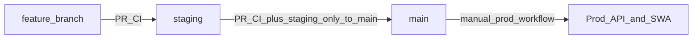

# CI/CD and branching (hand-in evidence)

Supporting the Cloud Computing module checklist: pipelines, branching, IaC paths, and secrets/OIDC pointers.

**Human-readable workflow map:** [`.github/workflows/README.md`](../.github/workflows/README.md)

See also `assesment/cloud-computing/module.md` in your local tree (that folder may be gitignored).

## Branch protection (Terraform) — no required check strings

**Terraform** (`terraform/envs/shared/github-governance/`) configures **repository rulesets** for **`main`** and **`staging`**:

- Merges go through a **pull request**; **force-push** and **branch deletion** are blocked.

We **do not** declare **`required_status_checks`** in Terraform. GitHub’s check **context** strings are easy to mismatch (renames, event suffixes), which produces **“Expected — Waiting for status”** even when jobs are green.

**CI** still runs on every PR via [`.github/workflows/pull-request-ci.yml`](../.github/workflows/pull-request-ci.yml) (lint, typecheck, build, Docker build). To **block** merges until those pass (or until the branch is up to date with the base), configure **required status checks** in the **GitHub UI** for the `staging` ruleset / branch settings and select the checks from the list after a green run — no magic strings in this repo.

**Promotion policy:** only **`staging`** may open a PR into **`main`** — [`.github/workflows/pull-request-main-branch-rules.yml`](../.github/workflows/pull-request-main-branch-rules.yml).

After changing Terraform rules, run `pnpm tf:apply:shared:github-governance`.

---

## Branch model

- Feature work branches from **`staging`**; pull requests target **`staging`**. CI runs on the PR; **no** shared staging deploy runs from feature branches until merge.
- Merges to **`staging`** trigger **`staging-deploy.yml`** (API container + staging SWAs together).
- PRs to **`main`**: CI + **`pull-request-main-branch-rules.yml`** (head must be **`staging`**).

## IaC and GitHub rules

| Area                                                             | Path                                                                                  |
| ---------------------------------------------------------------- | ------------------------------------------------------------------------------------- |
| GitHub rulesets (PR required, no force-push, no branch deletion) | `terraform/envs/shared/github-governance/` and `terraform/modules/github-repo-rules/` |
| Entra OIDC for Actions → Azure                                   | `terraform/modules/ci-identity/main.tf`                                               |

Apply with a repo-admin PAT (`TF_VAR_github_token` or `terraform.tfvars`); see `terraform/envs/shared/github-governance/terraform.tfvars.example`.

## Workflow files

| File                                 | Role                                                                           |
| ------------------------------------ | ------------------------------------------------------------------------------ |
| `pull-request-ci.yml`                | PRs → `staging` / `main`: build, oxlint, typecheck, Docker build API (no push) |
| `pull-request-main-branch-rules.yml` | PRs → `main`: fail unless head branch is `staging`                             |
| `staging-deploy.yml`                 | **Push `staging`**: staging API + all staging Static Web Apps (one workflow)   |
| `production-deploy.yml`              | **Manual**: prod API + prod Static Web Apps                                    |

## Release process (short)

1. PR **feature → `staging`**; merge when satisfied with CI.
2. **`staging`** push runs **`staging-deploy.yml`** (API + all staging SWAs).
3. PR **`staging` → `main`** when ready; CI + staging-head rule must pass.
4. Merge **`main`**; run **Production — full release** when you want production updated.

## IAM and secrets

- **Azure**: OIDC via `azure/login` and GitHub Environments **`staging`** / **`prod`** (see `ci-identity`).
- Do not commit application secrets or PATs; keep `terraform.tfvars` gitignored.
