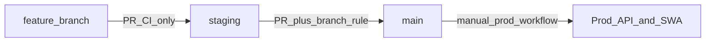

# CI/CD and branching (hand-in evidence)

Supporting the Cloud Computing module checklist: pipelines, branching, IaC paths, and secrets/OIDC pointers.

**Human-readable workflow map:** [`.github/workflows/README.md`](../.github/workflows/README.md)

See also `assesment/cloud-computing/module.md` in your local tree (that folder may be gitignored).

## Branch model

- Feature work branches from **`staging`**; pull requests target **`staging`**. CI runs on the PR; **no** shared staging deploy runs from feature branches.
- Merges to **`staging`** trigger **staging** deploys (API container + staging SWA).
- Pull requests to **`main`** must come **only** from **`staging`** (`pull-request-main-branch-rules.yml`).
- **Production (API + all prod Static Web Apps)** is **one manual workflow**: **`production-deploy.yml`** — run it on the branch/commit you want live (typically **`main`** after promoting `staging`).

## IaC and GitHub rules

| Area                                                                  | Path                                                                                  |
| --------------------------------------------------------------------- | ------------------------------------------------------------------------------------- |
| GitHub rulesets (require PR, no force-push, optional required checks) | `terraform/envs/shared/github-governance/` and `terraform/modules/github-repo-rules/` |
| Entra OIDC for Actions → Azure                                        | `terraform/modules/ci-identity/main.tf`                                               |

Apply GitHub governance with a repo-admin PAT (e.g. `TF_VAR_github_token`); see `terraform/envs/shared/github-governance/terraform.tfvars.example`. After CI has run once, copy **exact** check names from the **green** rows in the PR Checks tab into `required_ci_contexts_*` (often including the ` (pull_request)` suffix); a mismatch leaves required checks stuck on “Expected — Waiting for status” while jobs succeed.

## Workflow files (file names)

| File                                 | Role                                                                                      |
| ------------------------------------ | ----------------------------------------------------------------------------------------- |
| `pull-request-ci.yml`                | PRs → `staging` / `main`: lint, typecheck, `pnpm build`; Docker build API without push    |
| `pull-request-main-branch-rules.yml` | PRs → `main`: fail unless head branch is `staging`                                        |
| `staging-api-container.yml`          | **Push `staging` only**: ACR `:staging` + SHA, restart **staging** App Service            |
| `staging-frontend-swa.yml`           | **Push `staging` only**: staging Static Web Apps                                          |
| `production-deploy.yml`              | **Manual**: prod API `:latest` + restart **and** prod ops/portal/assets SWA, **same run** |

## Release process (short)

1. Open PR **feature → `staging`**, merge when CI is green.
2. Staging environment updates from **`staging` branch** pushes (API + frontends).
3. Open PR **`staging` → `main`** when ready to promote; branch-rule workflow + CI must pass.
4. Merge to **`main`** (no automatic production deploy).
5. Run **Production — full release (API + frontends)** on **`main`** so production API and all prod sites match that commit.

## One-time repo setup

Create branch **`staging`** from **`main`** on the remote if it does not exist yet, then protect behavior is enforced after Terraform rulesets apply:

`git checkout main && git pull && git checkout -b staging && git push -u origin staging`

## IAM and secrets

- **Azure**: GitHub Actions uses **OIDC** (`azure/login`) with `AZURE_CLIENT_ID`, `AZURE_TENANT_ID`, `AZURE_SUBSCRIPTION_ID` and environments **`staging`** / **`prod`** aligned with federated credentials in `ci-identity`.
- **Do not** commit application secrets; local `.env` files stay untracked per project `.gitignore`.
