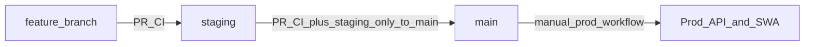

# CI/CD and branching (hand-in evidence)

Supporting the Cloud Computing module checklist: pipelines, branching, IaC paths, and secrets/OIDC pointers.

**Human-readable workflow map:** [`.github/workflows/README.md`](../.github/workflows/README.md)

See also `assesment/cloud-computing/module.md` in your local tree (that folder may be gitignored).

## Design decision: branch protection without Terraform-managed “required checks”

**Terraform** (`terraform/envs/shared/github-governance/`) configures **repository rulesets** for `main` and `staging`:

- Merges must go through a **pull request** (no direct pushes of new commits in the usual sense).
- **Force-push** and **branch deletion** are blocked.

We **do not** declare **`required_status_checks`** in Terraform. GitHub identifies required checks by **context strings** that are easy to get wrong (e.g. workflow renames, or a ` (pull_request)` suffix on the check name). Mismatches show **“Expected — Waiting for status”** even when jobs are green. Managing those strings in IaC felt **brittle and unreliable**, so merge-blocking gates are **not** codified in Terraform.

**CI still runs on every PR** via [`.github/workflows/pull-request-ci.yml`](../.github/workflows/pull-request-ci.yml) (lint, typecheck, build, Docker build). Failures are visible and should be fixed before merge under normal team practice; nothing stops you from turning on **optional** required checks **manually in the GitHub UI** later if you accept maintaining the names there.

**Promotion policy:** only branch **`staging`** may open a PR into **`main`**; that is enforced by [`.github/workflows/pull-request-main-branch-rules.yml`](../.github/workflows/pull-request-main-branch-rules.yml), not by Terraform check strings.

After changing rules in Terraform, run `pnpm tf:apply:shared:github-governance` so GitHub drops any **old** required-check rules that Terraform used to manage.

---

## Branch model

- Feature work branches from **`staging`**; pull requests target **`staging`**. CI runs on the PR; **no** shared staging deploy runs from feature branches until merge.
- Merges to **`staging`** trigger **staging** deploys (API container + staging SWA).
- PRs to **`main`**: CI + **`pull-request-main-branch-rules.yml`** (head must be **`staging`**).

## IaC and GitHub rules

| Area                                                             | Path                                                                                  |
| ---------------------------------------------------------------- | ------------------------------------------------------------------------------------- |
| GitHub rulesets (PR required, no force-push, no branch deletion) | `terraform/envs/shared/github-governance/` and `terraform/modules/github-repo-rules/` |
| Entra OIDC for Actions → Azure                                   | `terraform/modules/ci-identity/main.tf`                                               |

Apply with a repo-admin PAT (`TF_VAR_github_token` or `terraform.tfvars`); see `terraform/envs/shared/github-governance/terraform.tfvars.example`.

## Workflow files

| File                                 | Role                                                                           |
| ------------------------------------ | ------------------------------------------------------------------------------ |
| `pull-request-ci.yml`                | PRs → `staging` / `main`: build, oxlint, typecheck, Docker build API (no push) |
| `pull-request-main-branch-rules.yml` | PRs → `main`: fail unless head branch is `staging`                             |
| `staging-api-container.yml`          | **Push `staging`**: ACR `:staging` + SHA, restart staging App Service          |
| `staging-frontend-swa.yml`           | **Push `staging`**: staging Static Web Apps                                    |
| `production-deploy.yml`              | **Manual**: prod API + prod Static Web Apps                                    |

## Release process (short)

1. PR **feature → `staging`**; merge when satisfied with CI.
2. **`staging`** push deploys staging API + SWA.
3. PR **`staging` → `main`** when ready; CI + staging-head rule must pass.
4. Merge **`main`**; run **Production — full release** when you want production updated.

## IAM and secrets

- **Azure**: OIDC via `azure/login` and GitHub Environments **`staging`** / **`prod`** (see `ci-identity`).
- Do not commit application secrets or PATs; keep `terraform.tfvars` gitignored.
